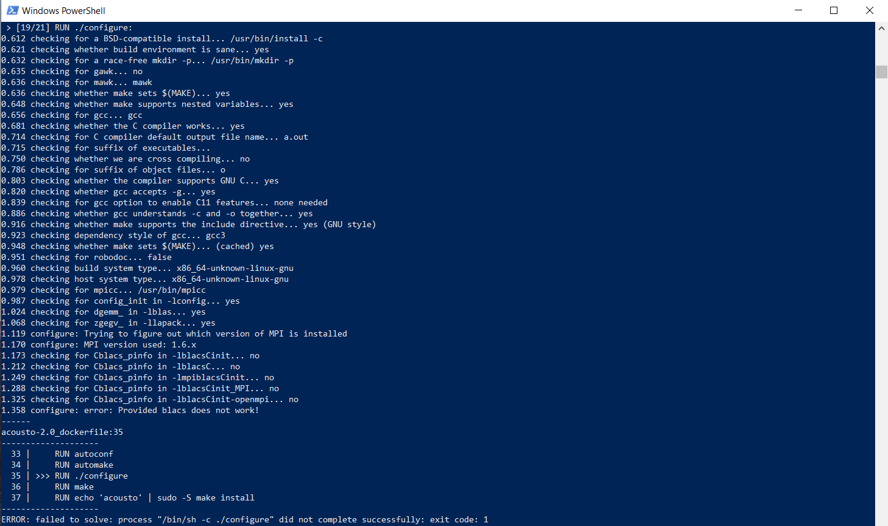
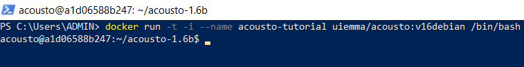

<p align="justify">
An introduction to AcouSTO, an open-source acoustic simulation solver, was given in the previous post. To continue learning about the software, the next step is to install it on a computer. I’m a Windows 10 user, so, although AcouSTO was built and primarily tested on Linux and OSX, I wanted to share a tutorial on how to set up the program for people who use this operating system.
</p>

<!--more-->

***
## A native version of AcouSTO is not available for Windows. How can we run it then?
***

<p align="justify">
AcouSTO's User Manual first chapter offers several options for software installation on a computer. As the software is not directly compatible with Windows, the program developers recommend the use of a Docker container to run AcouSTO. When I first read this, I didn't understand the installation process since I had never used a ‘‘Docker container’’ before and didn't know what it meant. If you happen to share this experience, allow me to explain what I’ve learned:
</p>

## An Introduction to Docker

<p align="justify">
Docker is an open-source platform used to run an application and its dependencies in an isolated environment. This environment is called a "container" and includes the code, runtime, system tools, and libraries of the application. Perhaps you have heard about virtual machines (VMs) and may associate them with the idea of emulating an entire operating system within your primary OS. For example, you could think about running a Linux distribution with AcouSTO installed within your Windows 10 Operating System. So then, why not just do this? Why is the use of a Docker container suggested instead? The answer to this question relies on the simple, efficient, and lightweight solution that Docker containers provide. When compared to virtual machines, Docker containers simulate only the operating system and the necessary application libraries instead of simulating the entire hardware required to run an emulated OS. This makes Docker a more lightweight and resource-efficient solution for running applications built in different operating systems.
</p>
<p align="justify">
To create a Docker container, you first need to reference a base image, which is essentially a copy of the setup environment of a specific OS distribution or application. There are two ways to obtain a base image for creating a Docker container:
</p>


1. *Building a container image from a _dockerfile_ :* <p align="justify"> _Dockerfiles_ are formatted text files that contain the instructions to build a Docker container. They define the configuration and setup of the environment within the container, specifying what software, libraries, and files should be included, and how the container should run. The Windows PowerShell terminal can be used to set the current directory to the path where the _Dockerfile_ is located. Then, a Docker container can be created by executing the following command in the terminal: </p>
```Docker
docker run -t -i name-of-image /bin/bash
```
2. *Building a container image from Docker Hub:* <p align="justify"> Docker Hub is a cloud-based repository where the Docker community can upload, store, and share container images. Pulling container images from Docker Hub is easy since the Docker Desktop application has a built-in search bar. Simply search for the image you need, and then click the ‘Pull’ button to create a container from that image. </p>

<p align="justify"> If any of the previous information remains unclear, here’s a short video by Fireship, which explains what Docker is in 100 seconds:
</p>



## Troubleshooting: Running AcouSTO within a Docker container 

* *‘Provided BLACS not working’ issue.*
<p align="justify"> In Chapter 1.2 of AcouSTO's User Manual, the developers provide instructions for setting up AcouSTO using Docker. I personally tried first to install AcouSTO by running the official dockerfile provided by the developers on the application website. However, I came across an issue that did not allow me to complete the installation. 
</p>



<p align="justify"> 
I looked for ways to solve the problem within the discussion forums on the <a href="https://sourceforge.net/projects/acousto/">AcouSTO sourceforge.net site</a>. In the ‘‘Help’’ sub-section I found a forum dedicated to addressing the error I received: <a href="https://sourceforge.net/p/acousto/discussion/852636/thread/ecebae1d2e/">‘‘Provided blacs do not work’’</a>. The discussion started in 2019 and offered a solution that seemed to have worked at that time. Umberto Iemma, one of the developers of the project,  suggested making a change in the _dockerfile_ to force the installation of version 8.6 of the Linux Debian distribution. This required changing line 6 of the file from  ‘‘FROM debian’’ to ‘‘FROM debian:8.6’’. After doing so, I was still getting the same error message. Upon reading further in the forum I learned that the Basic Linear Algebra Communication Subprograms (BLACS) library is now contained within another library that is not included as part of the setup environment in the current AcouSTO _dockerfile._ I might consider exploring a solution in the future. However, for now, it's much easier to build a Docker container by pulling a functional AcouSTO image from Docker Hub.
</p>

* *AcouSTO’s Docker container immediately stops when trying to run it.*

<p align="justify"> 
I faced a minor issue while setting up AcouSTO through Docker, however,  I still managed to install the solver by using this method. The problem occurred when pulling the image through the program’s search bar. Although the application environment was created, it couldn't continue to run. Therefore, I decided to create the container using Docker commands within the Windows Powershell terminal, which worked for me. So, in case you are interested in setting up AcouSTO, below I’ll share a step-by-step guide to help you install the program.
</p>

***
## The Windows user step-by-step guide for setting up AcouSTO
***

1. <p align="justify"> 
The Windows Subsystem for Linux, or WSL, is required to run Docker Desktop. This feature is enabled by accessing Windows Powershell as an administrator and typing the following command:
</p>

```PowerShell
wsl --install
```
<p align="justify"> 
A system restart is required after running the command.
</p>

<p align="justify"> 
You can also check out if you already have a WSL version by running the command:
</p>
```PowerShell
wsl -l -v
```
2. Download Docker Desktop from [this website.](https://www.docker.com/products/docker-desktop/)

3. Double-click *Docker Desktop Installer.exe* to run the installation manager.

4. When prompted, ensure the *‘‘Use WSL 2 instead of Hyper-V’’* option on the Configuration page is selected.

5. Follow the instructions on the installation wizard to authorize the installer and proceed with the installation.

6. When the installation is successful, select *‘‘Close’’* to complete the installation process.

7. Once Docker Desktop is installed, open the Windows Powershell terminal and run the following command:
```PowerShell
docker run -t -i --name container_custom_name uiemma/acousto:v16debian /bin/bash
```
<p align="justify"> 
This command pulls the AcouSTO image “uiemma/acousto:v16debian” from Docker Hub and creates a Docker container with the custom name: “container_custom_name”. For the purpose of this tutorial, I named my container “acousto-tutorial”. Currently, the only AcouSTO version that can be accessed through this method is version 1.6.
</p>

<p align="justify"> 
Once you complete all of the previous steps you’ll be logged into the AcouSTO virtual machine under the path $HOME/acousto-1.6. You can now use AcouSTO on your computer. The next tutorials will cover how to use this tool for acoustic simulation.
</p>



## The Windows user step-by-step guide for setting up AcouSTO

*Further accessing AcouSTO through Docker.*

1. Open the Windows Powershell terminal and start your AcouSTO Docker container by running the following command:

```Docker
docker start container_custom_name
```
2. Once the container is up and running, execute the docker container via the following command:
```Docker
docker exec -t -i container_custom_name /bin/bash
```
You’ll be logged into the container‘s environment under the path $HOME/acousto-1.6.

*Closing AcouSTO Docker container correctly.*

1. While inside the container’s environment, run the command “_exit_” in the command line to leave the AcouSTO container.
2. After doing so, make sure to stop the container environment by typing the following command in the terminal:
```Docker
docker stop container_custom_name
```
3. To ensure that the container has been closed successfully, you can use the command “_docker ps_” to display the list of all currently running containers. The list should not contain the container “container_custom_name”.
```Docker
docker ps
```

*Sharing files from the container to the Host OS*

I find it easier to share files by using the Docker Desktop user interface:

1. While on Docker Desktop, click on the container name to access its properties.

2. Click on the “_Files_” tab to access the environment directories.

3. Right-click on the file or folder you want to save, then select "_Save_" from the pop-up menu.

4. A window will appear for you to select where to save your file(s) in the File Explorer.

