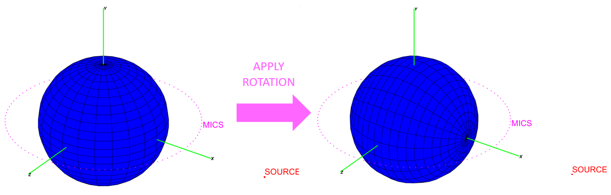

Now that AcouSTO is installed on our computer, we are ready to use it. Our first approach to the program will be the exercise found in Chapter 1 of the Book of Tutorials. This problem consists of the scattering of a spherical wave by a rigid sphere. Although the mathematical background of the analytical solution will be presented, the main focus of this post is to share a tutorial on the essential use of AcouSTO through the analysis of the structure of the configuration file.

<!--more-->

<h2> A (not so thorough) presentation of the analytical solution </h2>

The problem that we will be solving consists of the scattering of a sound wave around a rigid sphere. The source of the sound wave, which is located at a distance $r_s$ from the origin $O$, is a monopole of unit amplitude. This means that the source is simplified as a point in space that radiates sound equally in all directions.  The propagating sound wave will interact with the surface of a rigid sphere of radius $a$, whose center is coincident with the origin.  The problem has an axisymmetric behavior w.r.t. the axis that includes both the origin and the source location, therefore the complete solution for the whole field can be obtained by solving the problem for an arbitrary plane passing through the symmetry axis. The formulation of the problem within a generic plane can be written in polar coordinates; where the source would be located at $\mathbf{r_s}=(r_s,\theta)$. 

Now that we have a clear formulation of the situation let's continue by reviewing the governing equations of the acoustic problem. However, before we dive any further into mathematics, I must make a disclaimer. The math behind the solution to this problem can be somewhat complicated for a student who is just learning the basics of acoustics. Based on that reasoning, I will explain the main equations used by the software to solve the acoustic problem and clarify the meaning of its terms in a more beginner-friendly manner. 

AcouSTO solves for the velocity potential $(\phi)$ function of an acoustic field, which in this case  is written as:

 
$$
\nabla^2\phi + k^2
\phi = \delta(\mathbf{r} - \mathbf{r_s}), \text{ with    } \frac{\partial\phi}{\partial r} = 0 \text{ for } r = a \tag1
$$ 


On the left side of the equation, $\nabla^2\phi + k^2
\phi$, refers to the mathematical description of the behavior of waves that propagate through a fluid medium (like air). Here, the term $k= \frac{\omega}{c_0}$ is known as the wavenumber, which is a parameter that indicates the number of radians a wave changes per meter. On the other side of the equation, we have the expression $\delta(\mathbf{r} - \mathbf{r_s})$, which in mathematics is called the Dirac delta function. This function denotes an instantaneous impulse that occurs at a concentrated point in space and produces a sudden perturbation of the medium. In the studied scenario, equaling both expressions together means that we will solve for the potential velocity of the sound wave produced by the monopole. The additional comment, $\frac{\partial\phi}{\partial r} = 0 \text{ for } r = a$, indicates that the velocity potential around the boundary, or surface, of the rigid sphere will be constant. This is true for this particular problem, where the condition of axial symmetry is satisfied.

The solution to equation $(1)$ can be written, in polar coordinates, as follows:

 
$$
\phi(r,\theta)=\phi_{inc}+\phi_{sc}=-\frac{e^{ikR}}{4 \pi R} + \frac{ik}{2\pi}\sum_{n=0}^{\infty}{\left( n+\frac{1}{2} \right) \frac{j'_n(ka)h_n(kr_s)}{h'_n(ka)}}h_n(kr)P_n(\cos\theta) .\tag
$$
 

This equation is used to calculate the potential velocity measured at a circle formed by 100 microphones positioned at a distance  $r_{mics}=1.5a$ . Some of the terms within the equation may seem complex, hence, to provide a better understanding, a list containing their explanations is presented below:

<ol>
  <li> $\phi_{inc}$  and  $\phi_{sc}$ : Velocity potential of the incident and scattered field, respectively. The incident field refers to the velocity potential solution for a domain where no obstacle or interference is present. On the other hand, the scattered field delivers information regarding how the sound wave deviates from its original behavior once it encounters objects or boundaries.</li>

 <li>$h_n(kr)$ and $(kr)$: Hankel and Bessel functions of the first kind. Mathematical functions used in acoustics and wave physics to describe the radial components of spherical waves.</li>

 <li>$P_n(x)$: Legrende polynomial of order $n$. Refers to a mathematical expression used for solving Helmholtz's equation (equation $(1)$).</li>

 <li>$R=||\mathbf{r-r_s}||$: Indicates the magnitude of the distance distance between an arbitrary point in space, $\mathbf{r}=(r,\theta)$, and the point where the source is located, $\mathbf{r_s}=(r_s,0)$.</li>
</ol>

We will solve the acoustic problem for the given values $a=1$ and $r_s=3$. In the following section, we will discuss how the main configuration file is set up to solve the problem correctly with the use of AcouSTO.

<h2> Understanding the main configuration file </h2>

The files needed for the tutorial are located under the path:


~/acousto-1.6b/doc/tutorials/Sphere_Monopole$


For this first approach to AcouSTO, we'll only be using the following files:

<table class="tg">
<thead>
  <tr>
    <th class="tg-fymr">File name</th>
    <th class="tg-fymr">Content</th>
  </tr>
</thead>
<tbody>
  <tr>
    <td class="tg-0pky">sphere_source.cfg</td>
    <td class="tg-0pky">Main configuration file for setting up AcouSTO 's solver.</td>
  </tr>
  <tr>
    <td class="tg-0pky">acousto.sources</td>
    <td class="tg-0pky">Location and intensity of the sound source.</td>
  </tr>
  <tr>
    <td class="tg-0pky">acousto.mics1.5.mesh</td>
    <td class="tg-0pky">Coordinate placement for the circle of microphones.</td>
  </tr>
</tbody>
</table>

AcouSTO 's configuration files consist of modular code blocks. The blocks contain the parameter values for the many variables that the program has to consider when solving an acoustic simulation. Below, we will analyze the meaning behind the most important parameters of each of the blocks contained within the <em>sphere_source.cfg</em> configuration file.

<ul>
 <li> <strong><em>runinfo</em> block:</strong>
 </li>
</ul>

This block contains the general parameters and information about the code execution.


runinfo={
 active = 1; 
 title = "custom-title";   // Title of the current code execution
 owner = "name";           // Username of the person who runs the code
 ksymmi=24;                // Symmetry flag
 krow  =-1;                // Number of matrix rows to be loaded in RAM
 vsound  =343.0;           // Speed of sound, 343 m/s for standard air
};


The parameter <em>ksymmi</em> becomes particularly important for this problem as it indicates the number of symmetric slices that the solver will handle. Later it will be shown that the value of this parameter is consistent with the configuration of the geometry. For axis-symmetrical problems, the parameter has values $N>3$, where $N$ refers to the number of partitions of the geometry.  On the other hand, the <em>krow flag</em> controls memory allocation in RAM. When the value of this parameter is set to <em>krow</em> $\le 0$, like in this case, it indicates to AcouSTO that the number of matrixes to be loaded in RAM is equal to the total number of control points of the geometry. 

<ul>
 <li> <strong><em>modgeom</em> block and AcouSTO 's built-in geometry pre-processor:</strong>
 </li>
</ul>

This block establishes the geometry of the boundaries that are present in the acoustic problem. We won't be covering situations where the Combined Helmholtz Integral Equation Formulation is needed, therefore, the <em>chief_file</em> and <em>n_chief</em> parameters won't be commented in the following block of code.


modgeom={
 active = 1;       // Built-in geometry generation is active
 geoms = ["sph"];  // "sph" indicates that a Sphere geometry will be used
 mics_file = "acousto.mics1.5.mesh"; // Microphone coordinates file
 nmics = 100;   // Number of microphones in mics_file
 chief_file = "acousto.chief.mesh";
 nchief = 0;
};


Currently, AcouSTO has five geometry types that can be configured within the program:

<ol>
  <li>Sphere.</li>
  <li>Cylinder.</li>
  <li>Plate.</li>
  <li>Nodes.</li>
  <li>GMSH.</li>
</ol>

For this tutorial, it is sufficient to make use of the built-in sphere geometry type to build the rigid sphere of radius $a=1$ of our problem. Although the Book of Tutorials provides instructions for importing previously created geometries from GMSH, I will leave this alternative for a future tutorial, as it requires some knowledge of the program and I prefer to keep things simple for now. 


sph={
  type="sphere"; // Name of AcouSTO 's pre-built geometry
  radius=1.0;
  segments=24;  // Number of slices along the longitude of the sphere
  rings=24;     // Number of slices along the latitude of the sphere
translation={x=0.0; y=0.0; z=0.0;}; // Transformation parameters
rotation={x=0.0; y=-90.0; z=0.0;};
};


Notice that the longitudinal number of partitions coincides with the number of slices set up by the parameter <em>ksymmi</em> in the <em>modgeom</em> block (both parameters have a value of 24). One final note regarding geometry creation is a comment on transformations such as scaling, translation, and rotation. These transformations can be applied to geometries within AcouSTO by adding the following parameters:


mygeom={
...
scale = {
x = <x scaling factor>;
y = <y scaling factor>;
z = <z scaling factor>;
};
translation = {
x = <x translation>;
y = <y translation>;
z = <z translation>;
};
rotation = {
x = <rotation around X axis in degrees>;
y = <rotation around Y axis in degrees>;
z = <rotation around Z axis in degrees>;
};
}


In the particular case of the problem that we are solving, it is essential to rotate the spherical geometry by 90&deg around the Y global axis. This will align the sphere's default polar axis with the global X-axis, ensuring that the solution to the problem is symmetrical w.r.t. to the axis of convenience. This is graphically explained as shown in the following figure:

<ul>
 <li> <strong><em>modsol</em> block :</strong>
 </li>
</ul>

This block manages the solution parameters. In this block, <em>sigma</em> and <em>omega</em> are the real and imaginary parts of the Laplace variable, $s=\sigma+i\omega$. It is up to the user to enter the values for the frequency range in $rad/s$ using the parameters <em>minome</em> and <em>maxome</em>, or in $Hz$ by using the parameters <em>minfreq</em> and <em>maxfreq</em>.


modsol={
 active=1; // Activates the solution
 pre_calculate_coefs=1; // Activates coeffitient storage in RAM
 solver="GMRES"; // Selection of the solver type
 sources_file="acousto.sources"; // Source coordinates and frequency file
 nsourc=1; // Number of sources present in the acoustic problem
 knw=2; // Type of AcouSTO's math formulation (Type 1 or 2)
 rho=1.21; // Air density value [Kg/m^3]
 minsig=0.0; // Minimum value for sigma
 maxsig=0.0;  // Maximum value for sigma
 nsig=1; // Number of samples for sigma
 minfreq=171.5; // Minimum value for frequency [Hz]
 maxfreq=218.36;  // Maximum value for frequency [Hz]
 nome=1;  // Number of samples for omega
 printout=1; // Activates output in VTK format
 printmsh=1;  // Activates output in ASCIII format
 printwrl=1;  // Activates output in VRML2 format
 printvtk=1;  // Activates output in GMSH format
 print_on_master=1;
};


We have completed the explanation of AcouSTO 's pre-processing configuration for the scattering of a spherical wave by a rigid sphere. Now, we can proceed to run the configuration file through the solver to obtain the acoustic problem solutions. This will be covered in the next blog post.

<h2> Resources </h2>

Iemma, U. & Marchese, V. (2017). Book of Tutorials. https://acousto.sourceforge.net/Tutorials.pdf
Martin, G. (2011). Introduction to Sound Recording. https://www.tonmeister.ca/main/textbook/
Wikipedia. (2023). Legendre polynomials. https://en.wikipedia.org/wiki/Legendre_polynomials
